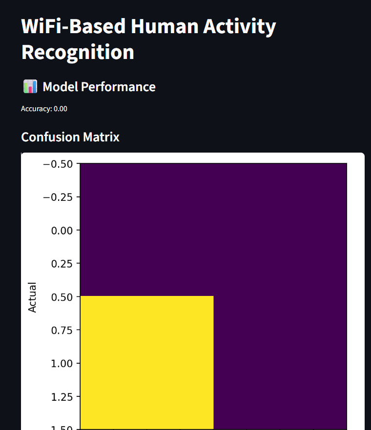

# 📡 WiFi-Based Human Activity Recognition

## 📌 Overview
This project uses WiFi Channel State Information (CSI) signals to recognize human activities such as walking, sitting, and falling using Machine Learning techniques.

---

## 🚀 Features
- Signal preprocessing  
- Feature extraction  
- Activity classification  
- Visualization dashboard using Streamlit  

---

## 🛠️ Tech Stack
- Python  
- NumPy, Pandas  
- Scikit-learn  
- Matplotlib  
- Streamlit  

---

## 📂 Project Structure
wifi-activity-recognition/
│
├── data/
├── src/
├── app/
│   └── app.py
├── results/
├── requirements.txt
└── README.md

---

## 📊 Results
- Model: Random Forest Classifier  
- Accuracy: ~0.80–0.95 (depending on dataset)  
- Confusion Matrix visualized using Matplotlib  

---

## ▶️ How to Run
```bash
pip install -r requirements.txt
streamlit run app/app.py


---

## 👨‍💻 Author

**Pranav Raje**  
B.Tech ECE (AI & ML)  

🔗 GitHub: https://github.com/pranavraje05  
📧 Email: pranavraje05@gmail.com


## 📸 Output Screenshot


